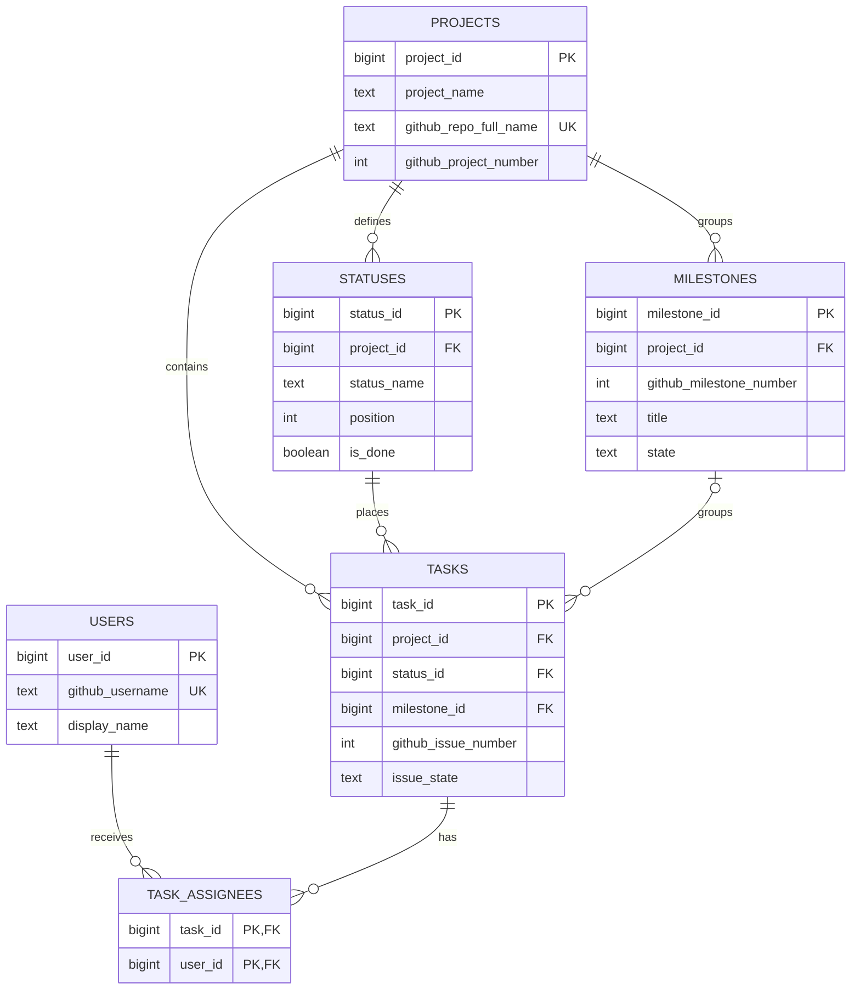

# CONES Kanban DB

CONES GitHub Issues와 GitHub Projects 칸반 보드를 관계형 데이터베이스로
표현하는 Supabase PostgreSQL 설계입니다. CONES 앱의 기존 커머스 테이블
(`products`, `orders` 등)은 수정하지 않습니다.

## 원본

- Repository: <https://github.com/seune-h0203/cones>
- Project: <https://github.com/users/seune-h0203/projects/3>
- 로컬 Issue 원본: [`data/raw/cones-issues.json`](data/raw/cones-issues.json)

참고 저장소의 사용자·작업 데이터를 CONES 데이터와 섞지 않았습니다.
참고 자료는 정규화, 다대다 담당자, Issue state와 Project status 분리 방법만
검토하는 데 사용했습니다.

## 확인된 데이터

| 항목 | 확인값 |
| --- | ---: |
| Repository Issues | 39 |
| Issue state | closed 34 / open 5 |
| Issue assignee 계정 | 4 |
| Assignee 관계 행 | 26 |
| 2명 이상 담당 Issue | 있음 |
| `CONES — FINAL SUBMISSION` Milestone | 31 Issues |
| Milestone 없는 Issue | 8 |

이 값은 공개 GitHub repository API에서 가져온 Issue snapshot 기준입니다.
Repository 전체 Issue 39건과 View 1 Project 카드 19건은 서로 다른 범위입니다.
`tasks`에는 View 1 TSV에 실제 포함된 19개 카드만 넣고, 나머지 20개 Issue는
보드 카드가 아니므로 제외했습니다.

### View 1 보드 snapshot

최종 원본은 [`cones-project-view1.tsv`](data/raw/cones-project-view1.tsv)입니다.
2026-09-25에 확인한 공개 View 1에서 제공된 TSV의 19행을 칸반 카드 범위로
사용했습니다. TSV의 `URL`에서 Issue 번호를 추출하고 `Status`를 칸반
상태로 적재했습니다.

| Status | `statuses.position` | 카드 수 |
| --- | ---: | ---: |
| Todo | 0 | 0 |
| In Progress | 1 | 3 |
| Done | 2 | 16 |

확인된 보드 Task는 Issue `#9, #13, #39`와 `#3, #1, #2, #4, #5, #6, #7,
#10, #11, #12, #32, #33, #34, #35, #36, #37`의 총 19건입니다.
Status 열 순서는 `statuses.position`으로 관리합니다. TSV에 없는 node_id와
Project item ID는 추측하지 않고 저장하지 않습니다.
Issue의 `open`/`closed`와 Milestone은 원본 Issues snapshot에서 별도로
확인했습니다. 저장소 전체 Issue 39건 중 TSV에 포함된 19건만 `tasks`에
적재했습니다.

### 포함·제외 기준

| 구분 | 기준 |
| --- | --- |
| 포함 | 최종 `cones-project-view1.tsv`에 행으로 존재하고 URL에서 Issue 번호를 확인할 수 있는 19개 카드 |
| 제외 | Repository Issue snapshot에는 있지만 View 1 TSV에 없는 20개 Issue |
| 보존 위치 | 전체 39건의 원본 API payload는 `data/raw/cones-issues.json`에 보존 |
| 상태 열 순서 | `tasks.status_position`을 사용하지 않고 `statuses.position`을 JOIN하여 조회 |

`discrepancy-report.md`에 참고 JSON의 `tasks: []`, orphan assignment,
Project 번호 `1` 대 URL `/projects/3` 차이와 후속 확인 방법을 기록했습니다.

## 스키마

| 테이블 | 역할 |
| --- | --- |
| `projects` | Repository와 Project 식별자 |
| `users` | GitHub 사용자 |
| `statuses` | Project 칸과 표시 순서 |
| `milestones` | GitHub Milestone |
| `tasks` | Issue 원본과 Project 카드 정보 |
| `task_assignees` | Task–User 다대다 관계, 복합 PK |

`tasks.issue_state`는 GitHub Issue의 `open`/`closed`이고,
`tasks.status_id`는 칸반 열입니다. 두 값을 하나의 상태 문자열로 합치지
않았습니다. `tasks.status_id`는 `(project_id, status_id)` 복합 외래 키로
동일 프로젝트의 `statuses`만 참조합니다. TSV에 없는 Project item ID와 node_id는 저장하지 않습니다. 전체 Issue API
payload는 [`data/raw/cones-issues.json`](data/raw/cones-issues.json)에만
원본으로 보존하고 핵심 테이블에는 복사하지 않습니다.

개념 ERD는 [`docs/kanban-erd.md`](docs/kanban-erd.md)에 있습니다. 주요
PK/FK와 Task–User 복합 PK도 ERD에 표시했습니다.

### Conceptual ERD

#### 관계와 정규화

- `projects`와 `statuses`를 분리해 보드명과 열 이름의 반복을 제거했습니다.
- `users`를 분리해 담당자 계정 정보를 한 번만 저장합니다.
- Task와 User는 한 Task에 여러 담당자가 배정될 수 있으므로
  `task_assignees` 연결 테이블로 N:M 관계를 표현합니다.
- `milestones`는 여러 Task가 공유하고, Milestone이 없는 Task도 허용합니다.
- `tasks.issue_state`는 GitHub Issue의 `open`/`closed`, `tasks.status_id`는
  Kanban 열이므로 서로 다른 속성으로 유지합니다.
- `tasks`는 내부 PK, 프로젝트 FK, Issue 번호·제목·URL, Issue state,
  status FK, 선택적 milestone FK만 유지해 카드 재현에 필요한 최소 구조로
  정제했습니다. Issue 본문·작성자·생성/종료 시각·node_id·Project item ID는
  핵심 테이블에서 제외했습니다.
- 각 독립 엔터티는 단일 PK를 사용하고, 연결 엔터티는
  `(task_id, user_id)` 복합 PK를 사용합니다.

### 과제 기준 확인표

| 과제 요구사항 | 저장소 반영 위치 | 상태 |
| --- | --- | --- |
| 실제 원본 보드 카드 19건 사용 | [`data/raw/cones-project-view1.tsv`](data/raw/cones-project-view1.tsv), [`seed.sql`](seed.sql) | 완료 |
| Todo / In Progress / Done 상태와 건수 | `statuses`, `tasks.status_id`, [`scripts/verify.sql`](scripts/verify.sql) | 완료 |
| Issue `open`/`closed`와 보드 Status 분리 | `tasks.issue_state`, `tasks.status_id` | 완료 |
| 엔터티·관계·정규화 설명 | 이 README의 관계와 정규화, [`db.spec.md`](db.spec.md) | 완료 |
| PK / FK / UNIQUE / CHECK | [`schema.sql`](schema.sql) | 완료 |
| 개념 ERD | 위 Mermaid ERD, [`docs/kanban-erd.md`](docs/kanban-erd.md) | 완료 |
| 실제 Supabase 테이블과 데이터 | Supabase 적용 결과 및 [`seed.sql`](seed.sql) | 완료 |
| JOIN으로 원본 보드 재현 | [`scripts/reproduce-board.sql`](scripts/reproduce-board.sql) | 완료 |
| 저장소 Issue 39건과 View 1 카드 19건 범위 검증 | [`scripts/verify.sql`](scripts/verify.sql) | 완료 |
| 상태별·전체·담당자 수·프로젝트 일치 검증 | [`scripts/verify.sql`](scripts/verify.sql) | 완료 |
| 원본 보드·Supabase·JOIN 화면 캡처 | [`docs/evidence/README.md`](docs/evidence/README.md) | 캡처 필요 |

## 실행 순서

1. Supabase SQL Editor에서 [`schema.sql`](schema.sql)을 실행합니다.
2. [`seed.sql`](seed.sql)을 실행합니다. Issue, 담당자, Milestone snapshot은
   재실행해도 중복되지 않도록 작성했습니다.
3. [`scripts/verify.sql`](scripts/verify.sql)을 실행합니다.
4. [`scripts/reproduce-board.sql`](scripts/reproduce-board.sql)을 실행해
   상태별 카드와 담당자를 조회합니다.

현재 seed는 최종 TSV의 19개 카드와 저장소 Issue 메타데이터를 재현합니다.
상태별 검증 결과는 Todo 0건, In Progress 3건, Done 16건, 총 19건입니다.
프로젝트-상태 참조 검증 결과는 불일치 0건이며, 마이그레이션은
[`migrations/004_enforce_project_status_scope.sql`](migrations/004_enforce_project_status_scope.sql)에
기록했습니다.

## 실제 적용 상태

- 설계 파일: 작성 완료
- 로컬 원본 분석: 완료
- Supabase 실제 적용: schema와 project/user/status/milestone 기준행 적용 완료
- Supabase Issue/task seed: 최종 TSV의 19개 카드 적용 완료
- RLS: 인증 정책을 검증하지 않아 미적용
- Project 카드 Status/순서 대조: 최종 TSV 기준 확인
- 실제 Supabase Table Editor / 원본 보드 / JOIN 결과 캡처: [`docs/evidence/README.md`](docs/evidence/README.md)의 체크리스트에 따라 발표용으로 필요

비밀키, service role key, PAT는 저장소와 문서에 넣지 않습니다.
