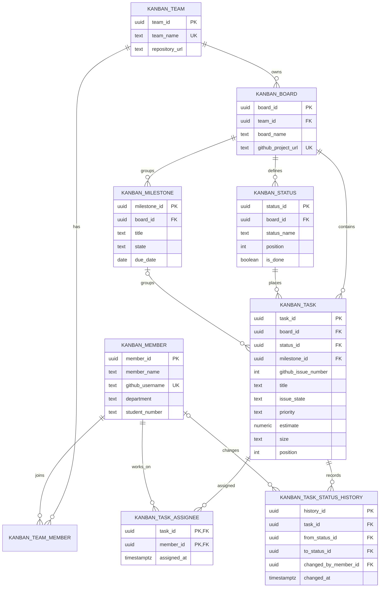

# OT Kanban DB Design

> GitHub Projects의 칸반 보드를 분석해 Supabase PostgreSQL 관계형 DB로 역설계한 과제 제출물입니다.

## 1. 원본 프로젝트

- 저장소: https://github.com/g202235438/ot
- GitHub Project: https://github.com/users/g202235438/projects/1
- 팀: 6조
- 주제: TRI-MOTION + FISHING 랜딩페이지

## 2. 프로젝트 목표

- 과제#3에서 사용한 GitHub Project의 실제 컬럼과 Issue를 원본 데이터로 사용합니다.
- 반복되는 팀원·상태·Milestone 데이터를 정규화합니다.
- Issue 상태와 보드 컬럼을 별도로 저장합니다.
- 담당자 다대다 관계와 카드 이동 이력을 표현합니다.
- PK, FK, UNIQUE, CHECK, 인덱스를 적용해 데이터 무결성을 보장합니다.

## 3. 원본 분석과 정규화

| 원본 정보 | 테이블 | 분리 이유 |
| --- | --- | --- |
| 6조와 저장소 | `kanban_team` | 소유 단위를 한 번만 저장 |
| 팀원과 역할 | `kanban_member`, `kanban_team_member` | 팀원 정보와 소속 분리 |
| GitHub Project | `kanban_board` | 보드 식별자와 원본 URL 관리 |
| Backlog / Ready / In progress / Done | `kanban_status` | 보드별 상태와 순서 관리 |
| 제출 목표 | `kanban_milestone` | 여러 Task가 공유하는 목표 |
| GitHub Issue 카드 | `kanban_task` | 작업 단위와 현재 위치 관리 |
| 여러 담당자 | `kanban_task_assignee` | Task–Member N:M 관계 |
| 카드 이동 | `kanban_task_status_history` | 상태 변경 시각과 변경자 보존 |

평면 테이블에 모든 값을 넣으면 보드명·상태명·담당자 정보가 반복되고, 한 카드에 여러 담당자를 저장하기 어렵습니다. 따라서 Team–Board–Status–Task 구조와 연결 테이블로 분리했습니다.

## 4. 테이블 구성

| 테이블 | 역할 |
| --- | --- |
| `kanban_team` | 팀과 원본 저장소 |
| `kanban_member` | GitHub 담당자 |
| `kanban_team_member` | 팀원 소속과 역할 |
| `kanban_board` | GitHub Project 보드 |
| `kanban_status` | 보드 상태와 표시 순서 |
| `kanban_milestone` | 여러 작업이 공유하는 목표 |
| `kanban_task` | GitHub Issue 기반 작업 카드 |
| `kanban_task_assignee` | Task와 담당자 연결 |
| `kanban_task_status_history` | Task 상태 이동 이력 |

## 5. 샘플 데이터

원본 TSV에서 확인한 카드 10개와 상태 컬럼 4개를 사용했습니다.

| 상태 | 카드 수 |
| --- | ---: |
| Backlog | 5 |
| Ready | 3 |
| In progress | 1 |
| Done | 1 |

원본 담당자 필드가 비어 있어 발표용 한글 샘플 담당자 3명을 추가했습니다. Issue URL, 우선순위, 예상치, 크기, 하위 이슈 진행률, 설명도 저장합니다.

## 6. 상태 모델

`kanban_task.status_id`는 보드에서의 위치이고 `kanban_task.issue_state`는 GitHub Issue의 열림/닫힘 상태입니다. 두 상태를 분리해 카드 이동과 Issue 상태 변경을 독립적으로 관리합니다.

## 7. Conceptual ERD

### 관계 설명

- 하나의 팀은 여러 팀원과 보드를 가집니다.
- 하나의 보드는 여러 상태, Milestone, Task를 가집니다.
- `kanban_task.status_id`는 보드에서의 현재 위치입니다.
- `kanban_task.issue_state`는 GitHub Issue 자체의 `open/closed` 상태입니다.
- Task와 팀원은 다대다 관계이며 `kanban_task_assignee`가 연결합니다.
- 카드 이동은 `kanban_task_status_history`에 이전 상태, 새 상태, 변경자, 변경 시각으로 기록합니다.

상세 ERD 문서는 [`docs/kanban-erd.md`](docs/kanban-erd.md)에서 확인할 수 있습니다.

## 8. 실행 및 검증

1. Supabase SQL Editor에서 [`migrations/002_rebuild_kanban_schema.sql`](migrations/002_rebuild_kanban_schema.sql)을 실행합니다.
2. [`scripts/verify.sql`](scripts/verify.sql)을 실행해 행 수와 상태별 Task 수를 확인합니다.
3. [`docs/kanban-erd.md`](docs/kanban-erd.md)의 Conceptual ERD를 발표자료에 포함합니다.
4. 상세 설계는 [`db.spec.md`](db.spec.md), 구조 설명은 [`architecture.md`](architecture.md)에서 확인합니다.

## 9. 보안

실제 Supabase 키, 비밀번호, `.env` 파일은 저장소에 포함하지 않습니다. `003_enable_public_read_rls.sql`에서 공개 보드 스냅샷에 대한 `SELECT`만 허용하고 `INSERT`, `UPDATE`, `DELETE`는 차단했습니다. 실제 팀 전용 서비스로 확장할 때는 공개 정책을 팀 멤버십 정책으로 좁혀야 합니다.

## 10. 참고한 설계

- [cones-db-design](https://github.com/Hamchaelim/cones-db-design)
- [team5-kanban-db](https://github.com/W0ongDang/team5-kanban-db)
- [asps-3](https://github.com/JooJeongwon/asps-3)

## 11. 발표용 요약

> 실제 GitHub Project 데이터를 바탕으로 팀·보드·상태·Milestone·Task·담당자·상태이력을 정규화하고, Issue 상태와 보드 상태를 분리해 Supabase에서 조회 가능한 간반 DB로 구현했습니다.
