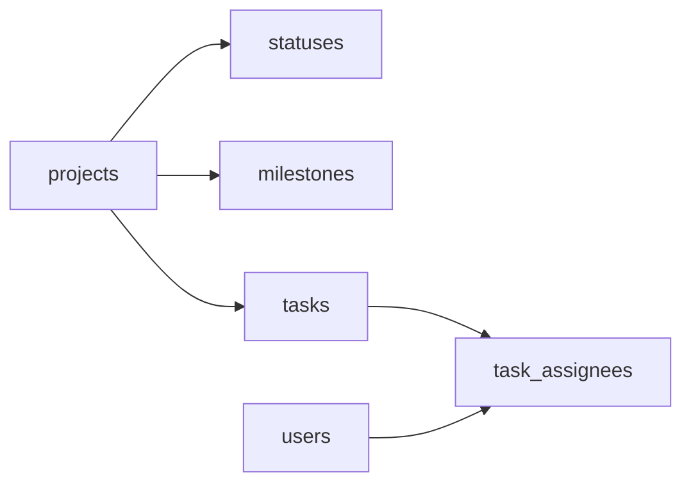

# CONES Kanban DB architecture

The schema intentionally models only entities supported by the CONES Issue and
Project requirements. Labels, comments, status history, and timeline events are
not added without a verified source requirement.

The source Issue state (`open`/`closed`) and the Project column are independent:
`tasks.issue_state` stores the former and `tasks.status_id` references the latter.
This prevents a closed Issue from being incorrectly treated as a specific Kanban
column.

The current board snapshot uses the manually observed public View 1 list dated
2026-09-25. Repository Issue metadata and assignees are joined to those 19
cards. Project item IDs remain NULL because they were not present in the
observation; future imports must not infer them.
