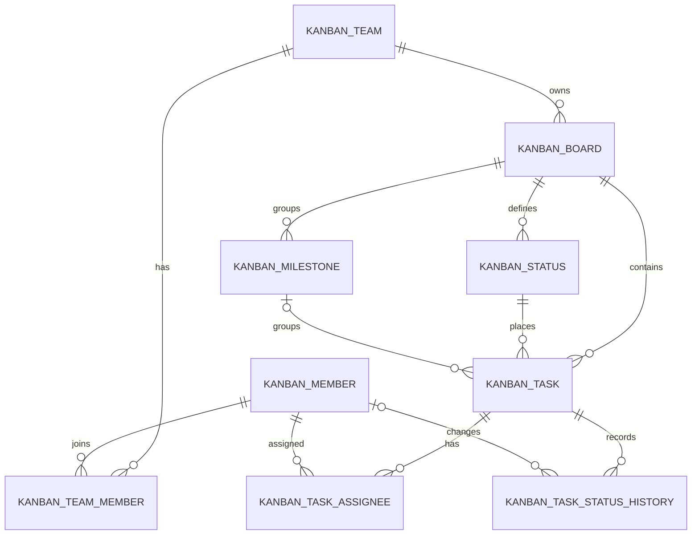

# OT Kanban DB Architecture

## 범위

이 프로젝트는 `g202235438/ot`의 GitHub Project 스냅샷을 Supabase PostgreSQL로 저장합니다. GitHub 내부 DB 전체를 복제하지 않고 칸반 화면에 필요한 보드·상태·Issue·담당자 관계를 정규화합니다.

## Entity 관계

## 상태 모델

| 값 | 의미 | 저장 위치 |
| --- | --- | --- |
| `Backlog`, `Ready`, `In progress`, `Done` | 보드에서 카드가 놓인 위치 | `kanban_task.status_id` |
| `open`, `closed` | GitHub Issue 자체 상태 | `kanban_task.issue_state` |

## 삭제 정책

- Team 삭제: Team Member, Board, Status, Milestone, Task까지 CASCADE
- Board 삭제: Status, Milestone, Task까지 CASCADE
- Milestone 삭제: Task의 `milestone_id`만 NULL
- Task 삭제: Assignee와 Status History까지 CASCADE
- Member 삭제: Team Member와 Assignee는 CASCADE, 상태 이력의 변경자는 NULL
