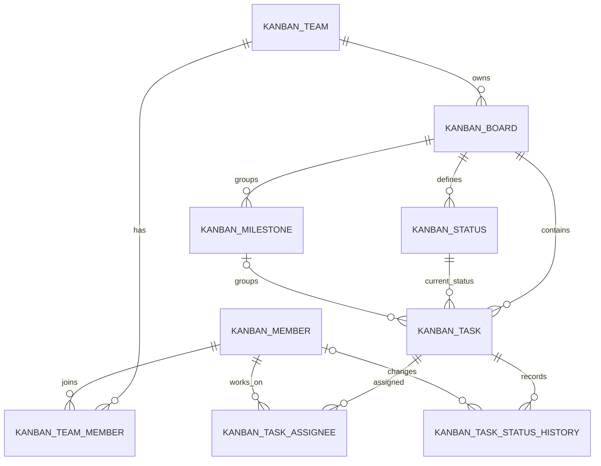

# Conceptual ERD

```mermaid
erDiagram
    KANBAN_TEAM ||--o{ KANBAN_TEAM_MEMBER : has
    KANBAN_MEMBER ||--o{ KANBAN_TEAM_MEMBER : joins
    KANBAN_TEAM ||--o{ KANBAN_BOARD : owns
    KANBAN_BOARD ||--o{ KANBAN_STATUS : defines
    KANBAN_BOARD ||--o{ KANBAN_MILESTONE : groups
    KANBAN_BOARD ||--o{ KANBAN_TASK : contains
    KANBAN_STATUS ||--o{ KANBAN_TASK : current_status
    KANBAN_MILESTONE o|--o{ KANBAN_TASK : groups
    KANBAN_TASK ||--o{ KANBAN_TASK_ASSIGNEE : assigned
    KANBAN_MEMBER ||--o{ KANBAN_TASK_ASSIGNEE : works_on
    KANBAN_TASK ||--o{ KANBAN_TASK_STATUS_HISTORY : records
    KANBAN_MEMBER o|--o{ KANBAN_TASK_STATUS_HISTORY : changes
```

- `status_id`는 보드에서의 위치를, `issue_state`는 GitHub Issue 상태를 나타냅니다.
- Task와 팀원은 다대다 관계이며 `kanban_task_assignee`가 연결합니다.
- 상태 이력은 이전 상태, 새 상태, 변경자, 변경 시각을 저장합니다.
