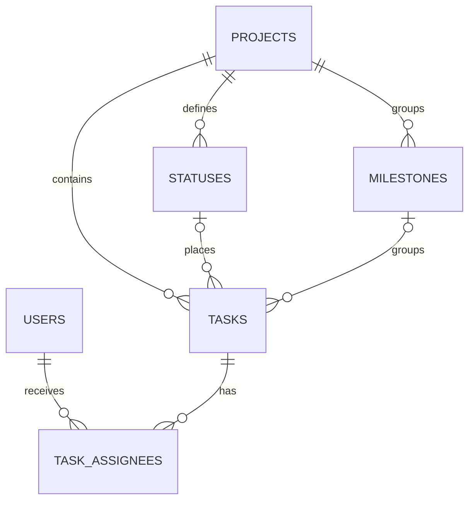

# CONES Kanban conceptual ERD

`TASKS.status_id` is nullable only while the live Projects item export is unavailable.
After Project item membership and status are verified, every board card receives a
status. `TASKS.issue_state` remains separate from the Kanban status because GitHub
Issue open/closed state and Project column are different concepts.
