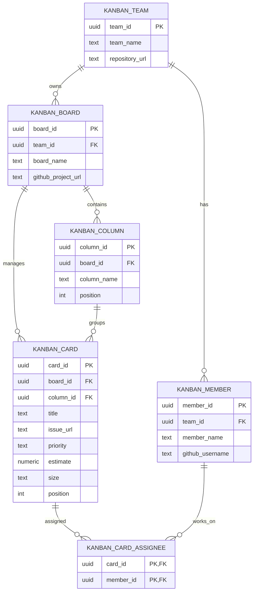

# Conceptual ERD

```mermaid
erDiagram
    KANBAN_TEAM ||--o{ KANBAN_MEMBER : has
    KANBAN_TEAM ||--o{ KANBAN_BOARD : owns
    KANBAN_BOARD ||--o{ KANBAN_COLUMN : contains
    KANBAN_BOARD ||--o{ KANBAN_CARD : manages
    KANBAN_COLUMN ||--o{ KANBAN_CARD : groups
    KANBAN_CARD ||--o{ KANBAN_CARD_ASSIGNEE : assigned
    KANBAN_MEMBER ||--o{ KANBAN_CARD_ASSIGNEE : works_on

    KANBAN_TEAM {
        uuid team_id PK
        text team_name
        text repository_url
    }
    KANBAN_MEMBER {
        uuid member_id PK
        uuid team_id FK
        text member_name
        text github_username
    }
    KANBAN_BOARD {
        uuid board_id PK
        uuid team_id FK
        text board_name
        text github_project_url
    }
    KANBAN_COLUMN {
        uuid column_id PK
        uuid board_id FK
        text column_name
        int position
    }
    KANBAN_CARD {
        uuid card_id PK
        uuid board_id FK
        uuid column_id FK
        text title
        text issue_url
        text priority
        numeric estimate
        text size
        int position
    }
    KANBAN_CARD_ASSIGNEE {
        uuid card_id PK, FK
        uuid member_id PK, FK
    }
```

## 관계 설명

- 팀 1개는 여러 팀원과 보드를 가집니다.
- 보드 1개는 여러 상태 컬럼과 카드를 가집니다.
- 컬럼 1개는 여러 카드를 포함합니다.
- 카드와 팀원은 다대다 관계이며 `kanban_card_assignee`가 연결합니다.
