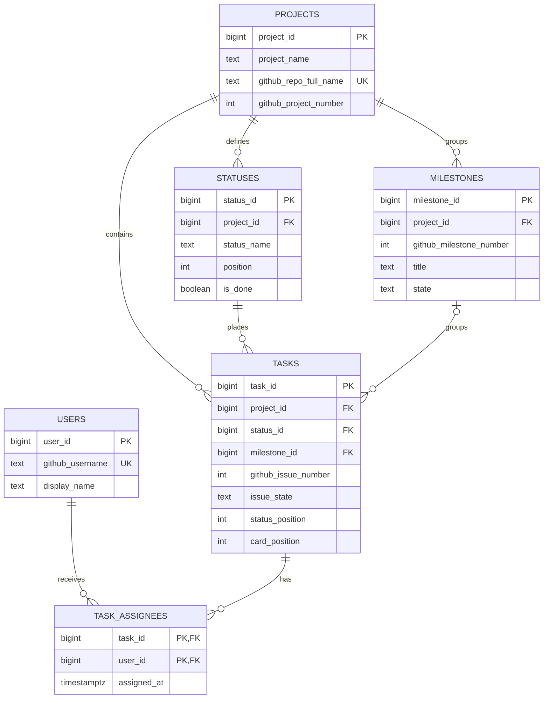

# CONES Kanban conceptual ERD

`TASKS.issue_state` stores the GitHub Issue `open`/`closed` value, while
`TASKS.status_id` stores the Kanban column from the final View 1 TSV. They are
intentionally separate. `github_project_item_id` is not shown as a populated
attribute because the TSV did not provide Project item IDs; the database column
exists and is NULL for all 19 imported cards.

